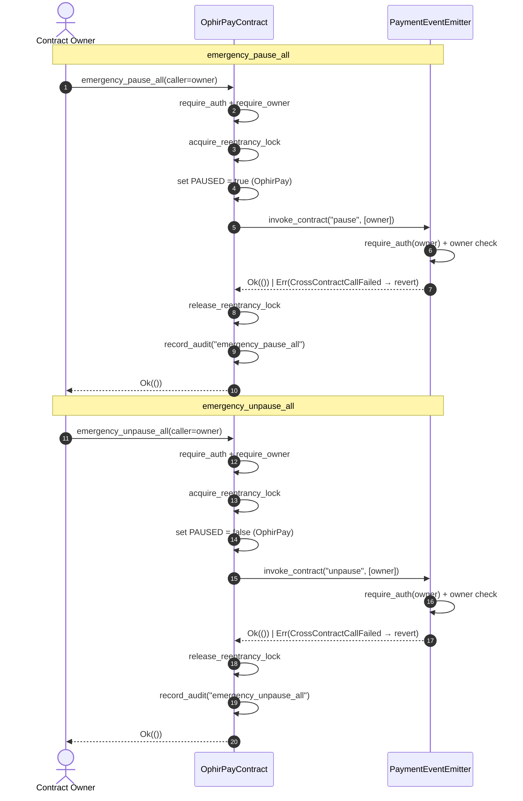

# Contract Architecture: OphirPay → Emitter

This document is a deep-dive into the **cross-contract communication pattern**
between the two Soroban contracts in this repository:

- **OphirPayContract** — `contracts/ophirpay/src/lib.rs` (the payment
  orchestration contract)
- **PaymentEventEmitter** — `contracts/emitter/src/lib.rs` (the event
  emission contract)

[`docs/architecture.md`](architecture.md) gives the high-level system view and
places the contracts inside the full platform. This page focuses on the
concrete invocation path: how OphirPay calls the Emitter with
`env.invoke_contract`, why the two concerns are split, and how to extend the
pattern when new contracts are added.

## 1. Why the concerns are split

The two contracts exist because payment logic and event emission have
different lifecycles, access patterns, and failure modes:

| Concern | OphirPayContract | PaymentEventEmitter |
|---|---|---|
| Responsibility | Payment domain rules: payments, escrows, streams, batches, refunds, multisig, RBAC, governance, timelocks, fees, hooks, audit | Event publication and query: `emit_payment`, `get_event`, `get_event_count` |
| Written by | Payment flows (record, validate, transition state) | Emitters (indexers, the SSE stream, notification relays) |
| Failure mode | A payment-domain error must revert the whole operation | An emission error must not corrupt payment state |
| Extensibility | Adding a new payment feature must not require touching event code | Adding a new event type must not require touching payment code |

The split keeps each contract single-purpose and independently testable, and
it lets the Emitter enforce its own access control (an allow-list of sources
that may emit, owner-only pause) without the payment contract knowing about
event internals.

OphirPay communicates with the Emitter **only** through a small, explicit
invocation surface: `set_emitter` / `get_emitter` on the OphirPay side and
`pause` / `unpause` on the Emitter side for the circuit breaker, with
`emit_payment` available to allow-listed callers. There is no shared storage
and no ambient authority — every hop is an explicit, authenticated,
error-propagating call.

## 2. The invocation pattern

Soroban contracts call each other with the
[`Env::invoke_contract`](https://docs.rs/soroban-sdk/latest/soroban_sdk/struct.Env.html#method.invoke_contract)
API. The OphirPay pattern is:

1. **Link the target** — the owner stores the Emitter address once via
   `set_emitter` (stored under the `EMITTER_ADDR` instance key).
2. **Build the call** — construct the function `Symbol` and a typed argument
   vector (`soroban_sdk::vec!`).
3. **Invoke** — `env.invoke_contract(&emitter, &fn_symbol, args)`.
4. **Propagate the result** — map a `Result` return to a local typed error so
   a failed sub-call reverts the entire transaction.
5. **Record the outcome** — write an audit entry on the calling side.

The caller's authorization flows through the invocation: the Emitter
re-validates the address it receives with `require_auth()` and its own owner /
allow-list checks, so a cross-contract call is never a backdoor.

## 3. Worked example: `emergency_pause_all`

The canonical example is the atomic circuit breaker. Both contracts expose
`pause` / `unpause`; OphirPay's `emergency_pause_all` pauses *itself* and then
pauses the Emitter in the same transaction, so a single owner action freezes
the whole system.

### 3.1 Calling side — `contracts/ophirpay/src/lib.rs`

```rust
/// Emergency pause: pauses BOTH OphirPay AND the linked Emitter contract
/// in a single atomic transaction. If the Emitter is not linked, only
/// OphirPay is paused.
pub fn emergency_pause_all(env: Env, caller: Address) -> Result<(), PaymentError> {
    caller.require_auth();
    require_owner(&env, &caller)?;
    acquire_reentrancy_lock(&env)?;

    // Pause OphirPay
    env.storage().instance().set(&PAUSED, &true);
    env.storage().instance().extend_ttl(5000, 50000);

    // Cross-contract call: pause the Emitter if linked. The result is
    // propagated (MEDIUM-5 audit fix): if the emitter fails to pause — e.g.
    // its owner differs from this contract's — the whole operation reverts
    // instead of silently leaving the emitter running.
    if let Some(emitter) = env.storage().instance().get(&EMITTER_ADDR) {
        let pause_fn = Symbol::new(&env, "pause");
        let args = soroban_sdk::vec![&env, caller.to_val()];
        let result: Result<(), soroban_sdk::Error> =
            env.invoke_contract(&emitter, &pause_fn, args);
        release_reentrancy_lock(&env);
        result.map_err(|_| PaymentError::CrossContractCallFailed)?;
    } else {
        release_reentrancy_lock(&env);
    }

    record_audit(
        &env,
        "emergency_pause_all",
        &caller,
        0,
        "All contracts paused",
    );
    Ok(())
}
```

Key points to notice:

- **`Symbol::new(&env, "pause")`** — the function name is resolved at runtime;
  there is no compile-time link between the two contracts.
- **`soroban_sdk::vec![&env, caller.to_val()]`** — the argument vector mirrors
  the Emitter's `pause(env, caller: Address)` signature exactly (positional,
  typed values converted with `.to_val()`).
- **`env.invoke_contract(&emitter, &pause_fn, args)`** — the raw return is a
  `Result<(), soroban_sdk::Error>`.
- **`result.map_err(|_| PaymentError::CrossContractCallFailed)?`** — a failed
  sub-call becomes a local error (`CrossContractCallFailed`), which `?`
  propagates and reverts the whole transaction. Nothing is left half-paused.
- **`acquire_reentrancy_lock` / `release_reentrancy_lock`** — the cross-contract
  call happens *inside* the reentrancy guard, so the Emitter cannot re-enter
  OphirPay mid-invocation. The lock is released before the error is propagated
  so a revert does not leave the lock stuck.
- **Audit** — `record_audit` gives the off-chain relayer an immutable trail of
  the orchestration event.

`emergency_unpause_all` is the mirror image: it invokes the `unpause` symbol on
the Emitter with the same argument shape.

### 3.2 Callee side — `contracts/emitter/src/lib.rs`

```rust
/// Pause event emission (owner only).
/// Used by the OphirPay orchestrator to freeze both contracts atomically.
pub fn pause(env: Env, caller: Address) -> Result<(), EmitterError> {
    caller.require_auth();
    let owner: Address = env
        .storage()
        .instance()
        .get(&EMITTER_OWNER)
        .ok_or(EmitterError::NotInitialized)?;
    if caller != owner {
        return Err(EmitterError::Unauthorized);
    }
    env.storage().instance().set(&PAUSED, &true);
    env.storage().instance().extend_ttl(5000, 50000);
    Ok(())
}
```

The Emitter does not trust its caller: it re-authenticates the address
(`caller.require_auth()`), verifies ownership, and only then mutates state.
This is what makes the pattern safe to extend — every function on the callee
side enforces its own access control.

### 3.3 Why the result must be propagated

Before the MEDIUM-5 audit fix, a failed Emitter pause could be swallowed,
leaving the Emitter running while OphirPay was paused — a half-open circuit
breaker. Propagating the result (`map_err(...)?`) turns any sub-call failure
into a full revert, restoring the invariant:

> **Invariant:** when an Emitter is linked, after `emergency_pause_all`
> returns `Ok`, both contracts are paused, and after `emergency_unpause_all`
> returns `Ok`, both are unpaused. Without a linked Emitter, only OphirPay
> changes state. If either function returns `Err`, the transaction reverts
> and *nothing* changed.

## 4. Sequence diagram



## 5. Extending the pattern to new contracts

The same shape extends to any new sub-contract (a relayer, an oracle, a
voucher contract, …). Follow this recipe:

1. **Link the address.** Add a storage key + `set_*` / `get_*` pair on the
   calling contract, owner-gated, mirroring `set_emitter` / `get_emitter`.
   Persist with `extend_ttl(5000, 50000)`.

2. **Define the callee surface.** On the new contract, expose `pub fn` entry
   points that (a) `require_auth()` the address they receive, (b) enforce
   their own owner / allow-list check, and (c) return `Result<_, LocalError>`.

3. **Invoke with typed args.** Build the function `Symbol` and a
   `soroban_sdk::vec![&env, ...]` argument vector whose order and types match
   the callee signature exactly. Use `Address::to_val`, `String::to_val`,
   `i128::to_val`, etc. for arguments.

4. **Map the return.** Wrap the raw `Result<_, soroban_sdk::Error>` from
   `invoke_contract` in a local error variant
   (`result.map_err(|_| PaymentError::CrossContractCallFailed)?`) so callers
   of *your* contract see a typed error and the transaction reverts on
   failure.

5. **Guard against reentrancy.** If the callee can call back into the caller,
   run the invocation inside `acquire_reentrancy_lock` / `release_reentrancy_lock`
   and release the lock before propagating errors.

6. **Audit the orchestration.** `record_audit(...)` on the calling side so
   every cross-contract action is queryable off-chain.

7. **Test the wiring.** Add contract tests that register both contracts in the
   same `Env`, link them (`set_emitter`), and assert the cross-contract
   behavior — see `test_emergency_pause_all` and `test_set_and_get_emitter`
   in `contracts/ophirpay/src/lib.rs`.

### Checklist for a new cross-contract function

- [ ] Callee address stored and owner-gated on the caller
- [ ] Callee re-validates auth and its own access control
- [ ] Argument vector matches the callee signature positionally
- [ ] Sub-call `Result` mapped to a typed local error and propagated with `?`
- [ ] Reentrancy lock held across the invocation (when the callee can re-enter)
- [ ] Audit entry recorded
- [ ] Contract test covering the happy path and the failure path

## 6. Related reading

- [`docs/architecture.md`](architecture.md) — the system-level architecture
- [`contracts/ophirpay/src/lib.rs`](../contracts/ophirpay/src/lib.rs) — the calling contract
- [`contracts/emitter/src/lib.rs`](../contracts/emitter/src/lib.rs) — the callee contract
- [`docs/AUDIT.md`](AUDIT.md) — MEDIUM-3 (emit allow-list) and MEDIUM-5
  (result propagation) findings referenced above
- [`CHANGELOG.md`](../CHANGELOG.md) — release history for cross-contract orchestration
